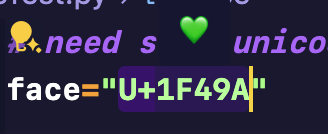

<div align="center">

# 🔤 Unicode Shower

**A powerful VSCode extension for viewing Unicode characters from their code points**

[English](#) | [中文](./readme_zh.md)

[](LICENSE)
[](package.json)



</div>

---

## ✨ Features

- 🎯 **Hover to View**: Simply hover over a Unicode code to see the character
- ⌨️ **Keyboard Shortcut**: Quick access with `⌘ Cmd + ⌥ Option + U` (macOS) or `Ctrl+Alt+U` (Windows/Linux)
- 🖱️ **Right-Click Menu**: Show Unicode character from context menu
- 🔄 **Multiple Formats**: Supports 6+ common Unicode notation formats
- 🌈 **Universal Support**: Works with emojis, CJK characters, symbols, and more

## 📋 Supported Formats

| Format | Example | Result | Description |
|--------|---------|--------|-------------|
| `U+XXXX` | `U+1F600` | 😀 | Standard Unicode notation |
| `\uXXXX` | `\u4E2D` | 中 | JavaScript/JSON style (4 digits) |
| `\UXXXXXXXX` | `\U0001F600` | 😀 | Python style (8 digits) |
| `\xXX` | `\x41` | A | Hex escape (2 digits) |
| `&#XXX;` | `&#128512;` | 😀 | HTML decimal entity |
| `&#xXXXX;` | `&#x1F600;` | 😀 | HTML hex entity |
| Pure Hex | `1F600` | 😀 | Raw hexadecimal (4+ digits) |

## 🚀 Quick Start

### Installation

1. Open VSCode
2. Go to Extensions (`Cmd+Shift+X` or `Ctrl+Shift+X`)
3. Search for "Unicode Shower"
4. Click Install

### Usage

**Method 1: Hover (Recommended)**
1. Select or hover over a Unicode code (e.g., `U+1F600`)
2. A tooltip will automatically show the character: 😀

**Method 2: Keyboard Shortcut**
1. Select a Unicode code
2. Press:
   - **macOS**: `⌘ Cmd + ⌥ Option + U`
   - **Windows/Linux**: `Ctrl + Alt + U`

**Method 3: Context Menu**
1. Select a Unicode code
2. Right-click → "Show Unicode Character"

## 📝 Examples

Try these in any supported file type (Python, JavaScript, TypeScript, Markdown, Plain Text):

```
U+1F600    → 😀  (Grinning Face emoji)
U+4E2D     → 中  (Chinese character)
\u2764     → ❤   (Red heart)
&#128512;  → 😀  (HTML decimal)
&#x1F44D;  → 👍  (Thumbs up)
1F680      → 🚀  (Rocket)
```

## 🎨 Supported Languages

The extension works with the following file types:
- Python (`.py`)
- JavaScript (`.js`)
- TypeScript (`.ts`)
- Markdown (`.md`)
- Plain Text (`.txt`)

## ⚙️ Configuration

Currently, the extension works out of the box with no configuration needed.

Future versions may include customizable options.

## 🛠️ Development

### Build from Source

```bash
# Clone the repository
git clone https://github.com/irisWirisW/unicode-show.git
cd unicode-show

# Install dependencies
npm install

# Compile
npm run compile

# Run in development mode
# Press F5 in VSCode to open Extension Development Host
```

### Testing

See [HOW_TO_TEST.md](./docs/HOW_TO_TEST.md) for detailed testing instructions.

## 📖 Documentation

- [Debug Guide](./docs/DEBUG_GUIDE.md) - How to debug the extension
- [Test Cases](./docs/TEST_CASES.md) - Complete list of test cases
- [How to Test](./docs/HOW_TO_TEST.md) - Testing procedures

## 🗺️ Roadmap

- [x] Hover tooltip display
- [x] Support multiple Unicode formats
- [x] Keyboard shortcuts
- [x] Context menu integration
- [ ] Status bar display
- [ ] Custom format configuration
- [ ] Batch conversion

## 🤝 Contributing

Contributions are welcome! Feel free to:
- Report bugs
- Suggest new features
- Submit pull requests

## 📄 License

This project is licensed under the MIT License - see the [LICENSE](LICENSE) file for details.

## 🙏 Acknowledgments

Inspired by the need to quickly view Unicode characters while coding.

## 📮 Contact

- **Issues**: [GitHub Issues](https://github.com/irisWirisW/unicode-show/issues)
- **Repository**: [GitHub](https://github.com/irisWirisW/unicode-show)

---

<div align="center">

Made with ❤️ by [1ris_W](https://github.com/irisWirisW)

**If you find this extension helpful, please give it a ⭐ on GitHub!**

</div>
