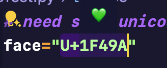

# Unicode Shower

English|[中文](./readme_zh.md)

## Description

The function of this extension is to select a piece of unicode code and then display the corresponding character.

## Looks like

## Support Format

- U+XXXXXX
- \uXXXX
- \UXXXXXXXX
- \xXX
- &#XXX
- &#xXXXX

## Support encode

- UTF-8
- Unicode

## Usage

Select the unicode code, then press the shortcut key `ctrl+alt+u`, use `cmd+alt+u` on mac.

## TODO

- [ ] Add a suspended window display
- [ ] Display in the status bar below
